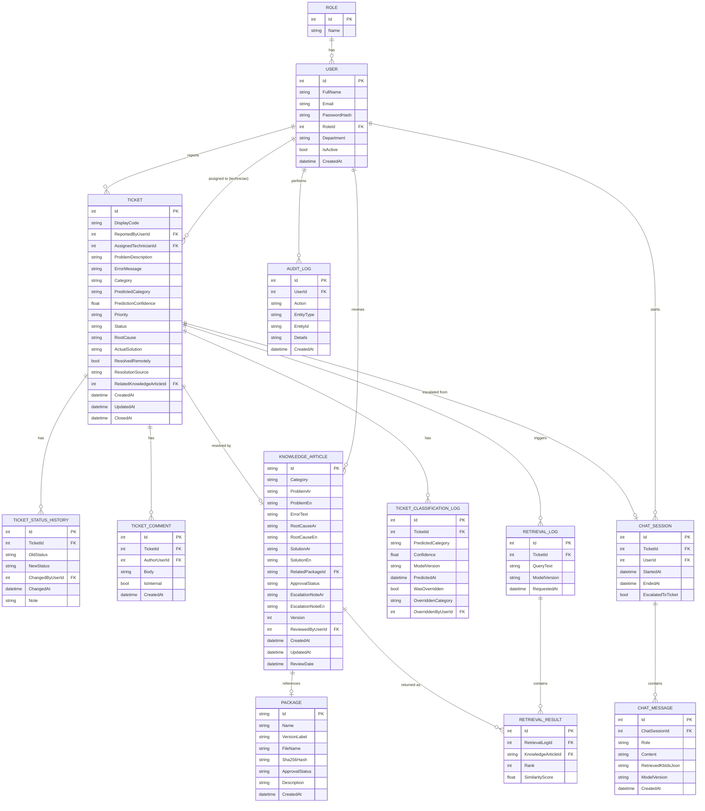

# SmartHelp AI — ERD (Sprint MVP scope)

Scope: what the 3-week sprint proposal actually demos (tickets, classification, retrieval, RAG, escalation). Deliberately excludes Workshop/Device repair, Inventory/StockTransaction, and Appointment/Availability entities — those are out of scope per the proposal (section G) and would be added in the 12-month roadmap (analysis doc, Phases 3/4/5) without redesigning this core.

## Design notes

- **`Ticket.Category` vs `PredictedCategory`**: `Category` is the confirmed/ground-truth label (set by the reporter or overridden by a technician); `PredictedCategory` + `PredictionConfidence` is what the AI classifier returned. Keeping both, plus `TicketClassificationLog`, is what makes the override-rate and accuracy metrics (analysis doc §9.1) measurable instead of asserted.
- **`ResolutionSource`** (`SelfService` / `Chatbot` / `Technician`) is the field the "self-service resolution rate" and "First Contact Resolution" KPIs (§9.2) are computed from — without it those KPIs have no data to read from.
- **`RetrievalLog` + `RetrievalResult`** normalize Top-K results into rows (article id, rank, similarity score) rather than a JSON blob, so Top-1/Top-3 success can be computed with a plain SQL query against the eval set.
- **`Package` is metadata-only** — no stock/quantity fields. It exists so `KnowledgeArticle.RelatedPackageId` and the "AI recommends only approved Package IDs" security requirement (§7.1) are representable. Stock transactions are a Phase 4 (analysis doc) extension, not built here.
- **`KnowledgeArticle.Id` and `Package.Id` are strings** (`KB-0001`, `PKG-0041`) to match the dataset already generated in `data/knowledge_base.json`, rather than surrogate ints that would need remapping.
- **Not modeled**: Workshop/Device/Repair, Inventory/StockTransaction, Appointment/TechnicianAvailability — explicitly out of scope for the sprint (proposal section G).
